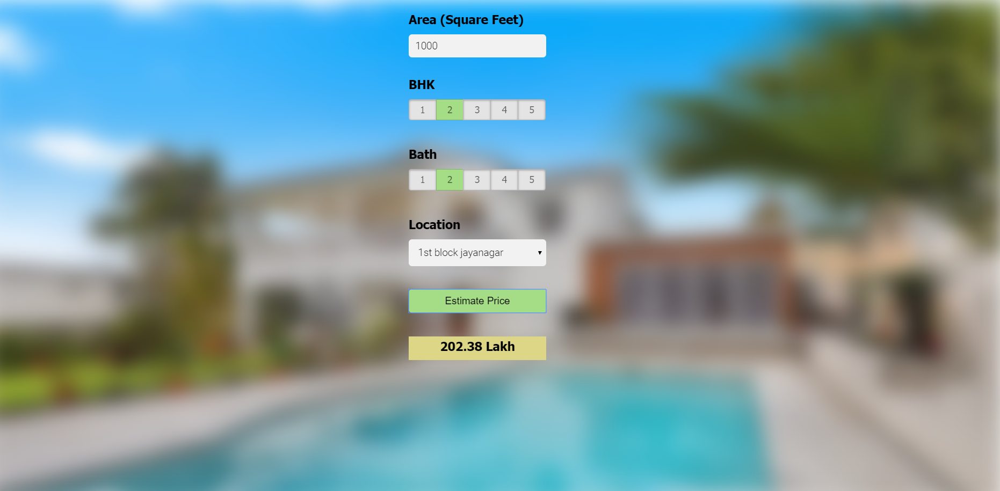

# 🏠 House Price Prediction Web App

A full-stack machine learning web application that predicts house prices based on user inputs like location, square footage, number of bedrooms, and bathrooms.

## 🚀 Live Demo

👉 https://house-price-prediction-1-66u4.onrender.com/

## 📌 Overview

This project demonstrates an end-to-end machine learning workflow:

- Data cleaning and preprocessing
- Feature engineering
- Model training using **Linear Regression (Scikit-learn)**
- Backend API using **Flask**
- Frontend built with **HTML, CSS, JavaScript**
- Deployment using **Render**

## 🧠 Features

- Predict house prices instantly
- Dynamic location dropdown from backend
- REST API integration
- Simple and responsive UI
- Fully deployed online

---

## ⚙️ Tech Stack

- Python
- Flask
- Scikit-learn
- NumPy / Pandas
- HTML / CSS / JavaScript
- Render (Deployment)

